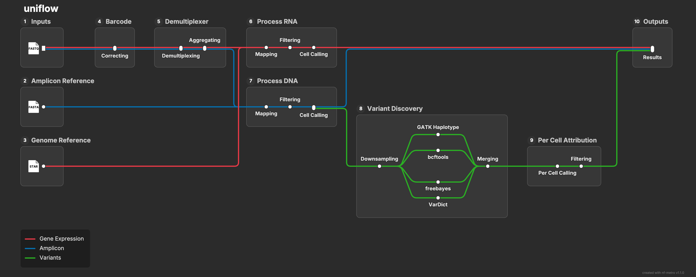

  

[← Repository](../README.md) · [Getting started](getting-started.md) · [Installation](installation.md) · [Inputs](inputs.md) · [Running](running.md) · [Outputs](outputs.md) · [Genotyping](genotype.md) · [Support](support.md)

---

# Uniflow documentation

Use this documentation to install Uniflow, prepare an experiment, run the pipeline, review its outputs, and contact Atrandi support when needed.

# Key concepts

To help with the general understanding of the pipeline, we use some specific vocabulary definitions.

### Library type

A library type describes the sequencing library supplied to the pipeline. Uniflow supports two library types:

* RNA: reads originating from RNA (cDNA)-derived molecules.
* DNA: reads originating from DNA (amplicon)-derived molecules.

An experiment may contain RNA libraries, DNA libraries, or both.

### Modality

A modality is the data analytical representation derived from a library. The current pipeline handles the following modalities:

- `gene_expression`: UMI counts per gene per cell from the RNA library
- `amplicon`: Read counts per amplicon per cell from the DNA library
- `snv` and/or `indel`: SNV or indels and per cell genotypeing from the DNA library (see [Genotyping](genotype.md) for details)

## How Uniflow processes an experiment

1. **Inputs:** Uniflow reads the paired-end RNA and DNA FASTQ files listed in the sample sheet. Either library type may be omitted.
2. **Amplicon reference:** The amplicon FASTA defines the expected DNA targets.
3. **Genome reference:** The STAR index provides the reference used for RNA alignment.
4. **Barcode correction:** Cell barcodes are extracted and corrected against the product whitelist.
5. **Demultiplexing and aggregation:** Plate coordinates can split libraries into samples, while lanes and libraries belonging to the same sample are combined.
6. **RNA processing:** RNA reads are mapped to the genome, filtered, and used for cell calling and gene-expression quantification.
7. **DNA processing:** DNA reads are mapped to the amplicon reference, filtered, and used for cell calling and amplicon read counting.
8. **Variant discovery:** When enabled, DNA reads are downsampled and processed by multiple variant callers. Their calls are normalized and merged into a consensus.
9. **Per-cell attribution:** Discovered variants are filtered and attributed to individual cells.
10. **Outputs:** Uniflow produces experiment and sample reports, metrics, count objects, aligned reads, and exploratory outputs.

## Documentation sections

1. [Install Uniflow](installation.md)
2. [Prepare inputs](inputs.md)
3. [Run Uniflow](running.md)
4. [Understand outputs](outputs.md)
5. [Understand genotype outputs](genotype.md)
6. [Troubleshooting and support](support.md)
