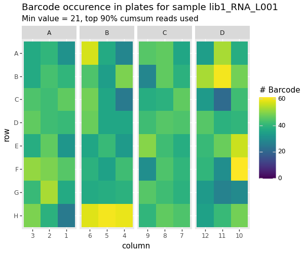
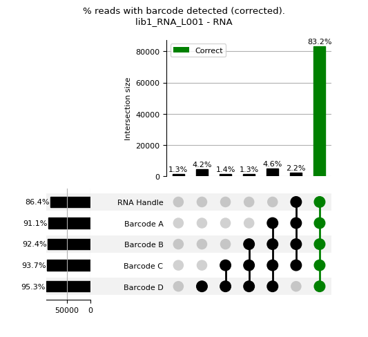
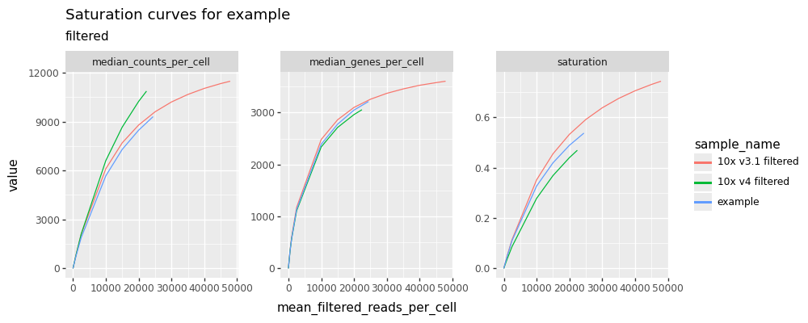
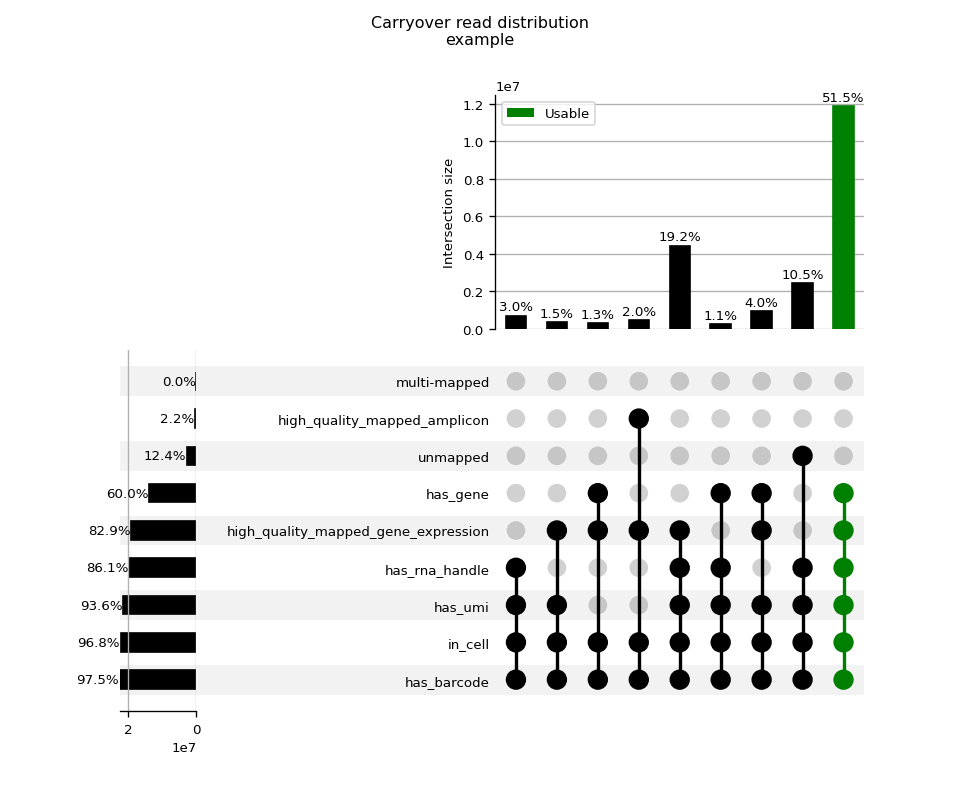
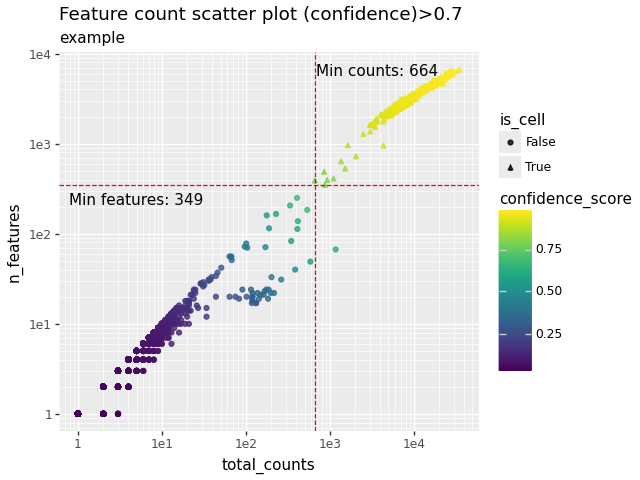
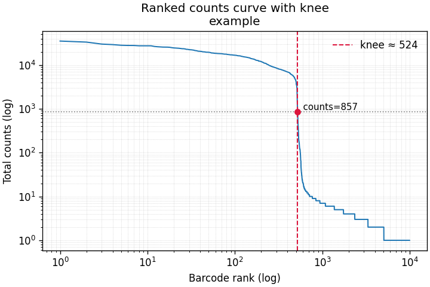
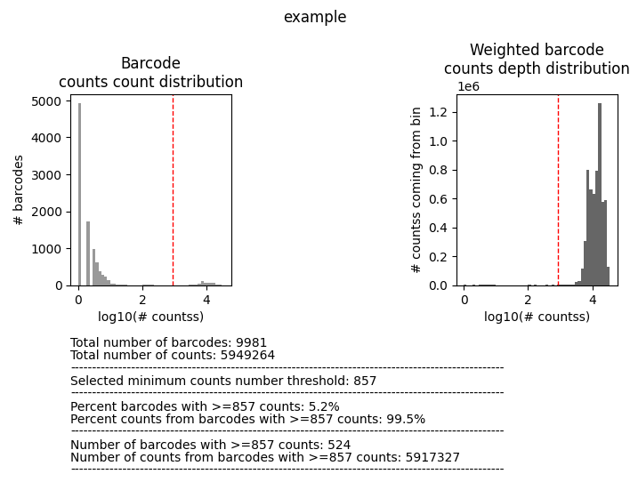
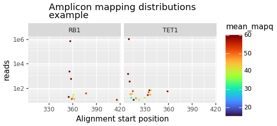
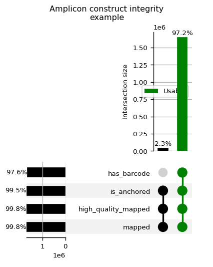

# Directory overview

```text
samples/<sample_id>/qc/
├── amplicon/
├── barcode/
├── carryover/
└── gene_expression/
```

| Directory | Purpose |
| --- | --- |
| `amplicon/` | QC for the DNA amplicon part of the assay, including read usability, mapping behavior, cell calling, and per-cell amplicon signal. |
| `barcode/` | QC for single-cell barcode structure and barcode combination recovery in RNA and DNA libraries. |
| `carryover/` | QC for signal that may indicate cross-modality carryover or unexpected alignment to positive or negative control targets. |
| `gene_expression/` | QC for the RNA gene expression part of the assay, including mapping, cell calling, library complexity, and sequencing saturation. |


# QC `.png` Graph Output Guide

This guide explains each `.png` generated by the uniflow pipeline and provides basic queues on how to interpret the graphs for QC decisions. 

## barcode_occurence_heatmap.png


### Overview

This plot evaluates barcode composition prior to cell-level filtering.
It shows the distribution of corrected barcode reads across plate
coordinates (row/column) for each barcode position (A/B/C/D). Only
whitelisted barcodes are included, and barcode combinations are ranked
by abundance and truncated to the top 90% cumulative fraction. The
heatmap color scale ranges from 0 to the maximum observed barcode count.

### Graph interpretation

-   Healthy pattern: broad and relatively even occupancy across expected
    plate regions.
-   Warning signs:
    -   extreme hotspots in a few wells → potential pipetting or
        ligation imbalance
    -   missing stripes or blocks → possible row/column failures or
        systematic dropout
    -   strong asymmetry between A/B/C/D → step-specific issue (except
        expected asymmetry in A when multiplexed)

## barcode_upset_plot.png


### Overview

This plot assesses read-level barcode completeness and correctness using
UpSet intersections. Each read is evaluated for valid barcode components
(A/B/C/D whitelist membership) and, when applicable, presence of the
universal RT primer (GACTTGAGTGGCTGTCGG). Only subsets representing at
least 1% of reads are displayed.

### Graph interpretation

-   Healthy pattern: dominant intersection where all required components
    are present
-   Warning signs:
    -   large partial intersections → incomplete barcode capture
    -   high fraction missing multiple components → global barcode or
        chemistry issue
    -   enrichment of primer failures (RNA) → primer/handle capture
        problem

## filtered_saturation.png




### Overview

This plot evaluates RNA library complexity and sequencing saturation
within called cells. It shows curves for median UMIs per cell, median
genes per cell, and saturation (1 - unique_molecule_groups / reads)
across sequencing depth. Only high-quality RNA reads are included (MAPQ
255, gene-assigned, valid corrected UMI), and curves include both
observed depths and fixed low-depth anchor points (2500, 1000, 500 reads
per cell).

### Graph interpretation

-   Healthy pattern: UMIs and genes per cell increase and gradually
    plateau; saturation rises smoothly
-   Warning signs:
    -   early plateau → low complexity or high duplication
    -   non-monotonic or unstable curves → poor cell quality or low
        input

## carryover_upset_plot.png




### Overview

This plot quantifies cross-modality carryover between RNA and amplicon
data using read-state intersections. RNA reads require MAPQ 255 (STAR),
DNA reads require MAPQ ≥20 (MINIMAP2). "Usable reads" are defined by a
strict combination of valid RNA features and exclusion of high-quality
amplicon mapping, unmapped, and multi-mapped reads.

### Graph interpretation

-   Healthy pattern: low fraction of problematic intersections within
    cells
-   Warning signs:
    -   large non-usable fraction in cells → contamination
    -   high unmapped or multi-mapped fraction → reference issues
    -   amplicon signal in RNA context → modality bleed-through

## experimental_feature_count_scatter.png (WILL RENAME WIP)



### Overview

This plot compares total counts vs detected features per barcode (genes
for RNA, amplicons for DNA), colored by confidence score and cell-call
status.

### Graph interpretation

-   Healthy pattern: clear high-count/high-feature cell cluster
-   Warning signs:
    -   overlap between populations → weak filtering
    -   high-count low-feature → artifacts/multiplets

## knee_plot.png



### Overview

Ranked barcode depth plot (RNA UMIs or DNA reads) showing inferred
cutoff between signal and background.

### Graph interpretation

-   Healthy pattern: sharp bend (knee) separating populations
-   Warning signs:
    -   no bend → ambiguous cell boundary
    -   shallow slope → elevated background

## mapped_histo.png



### Overview

Histogram of barcode depth (log10), weighted counts, and retention
metrics above threshold.

### Graph interpretation

-   Healthy pattern: threshold cleanly separates signal and noise
-   Warning signs:
    -   threshold cuts main distribution → over-filtering
    -   low retention → poor library quality

## amplicon_alignment_distribution.png



### Overview

Distribution of amplicon start positions colored by mapping quality.

### Graph interpretation

-   Healthy pattern: tight peaks at expected loci
-   Warning signs:
    -   broad smear → poor anchoring
    -   off-target peaks → nonspecific amplification

## amplicon_upset_plot.png




### Overview

DNA amplicon read integrity intersections based on barcode, mapping,
anchoring, and quality states.

### Graph interpretation

-   Healthy pattern: majority fully valid reads
-   Warning signs:
    -   partial-state dominance → assay instability
    -   missing anchoring/mapping → failure in pipeline stage
---

## Developer quick reference

| `.png` filename/pattern | Process/module source | Primary purpose |
|---|---|---|
| `*_barcode_occurence_heatmap.png` | `process QC_BARCODE`, `plot_barcode_occurence_heatmap()` | Barcode plate-balance QC for combinatorial barcodes A/B/C/D |
| `*_barcode_upset_plot.png` | `process QC_BARCODE`, `plot_barcode_upset_plot()` | Read-level barcode completeness / whitelist correctness intersections |
| `*_filtered_saturation.png` (`*_saturation.png`) | `process GET_SATURATION_CURVES`, `plot_comparative_saturation_curves()` | RNA depth-vs-yield saturation against embedded 10x references |
| `carryover_upset_plot.png` | `process QC_AMPLICON_CARRYOVER`, `plot_generic_upset_plot()` | Cross-modality RNA/DNA carryover state intersections |
| `pos_alignment_distribution.png` | `process QC_AMPLICON_CARRYOVER`, `plot_amplicon_anchors()` | Positive-strand carryover alignment start distribution |
| `neg_alignment_distribution.png` | `process QC_AMPLICON_CARRYOVER`, `plot_amplicon_anchors()` | Negative-strand carryover alignment start distribution |
| `experimental_knee_plot.png` | `process FILTER_GENE_EXPRESSION_CELLS`, `process FILTER_AMPLICON_CELLS`, `experimental_knee_plot()` | Confidence-ranked barcode/cell boundary visualization |
| `experimental_feature_count_scatter.png` | same filtering processes, `plot_feature_count_scatter()` | Total-count vs feature-count separation of likely cells/non-cells |
| `knee_plot.png` | same filtering processes, `plot_rank_knee()` | Classic rank-depth knee with inferred cutoff marker |
| `mapped_histo.png` | same filtering processes, `plot_histograms()` | Distribution + threshold-retention summary panel |
| `amplicon_alignment_distribution.png` | `process QC_AMPLICON`, `plot_amplicon_anchors()` | DNA amplicon anchor/start-position QC |
| `amplicon_upset_plot.png` | `process QC_AMPLICON`, `plot_generic_upset_plot()` | DNA amplicon construct-integrity intersections |